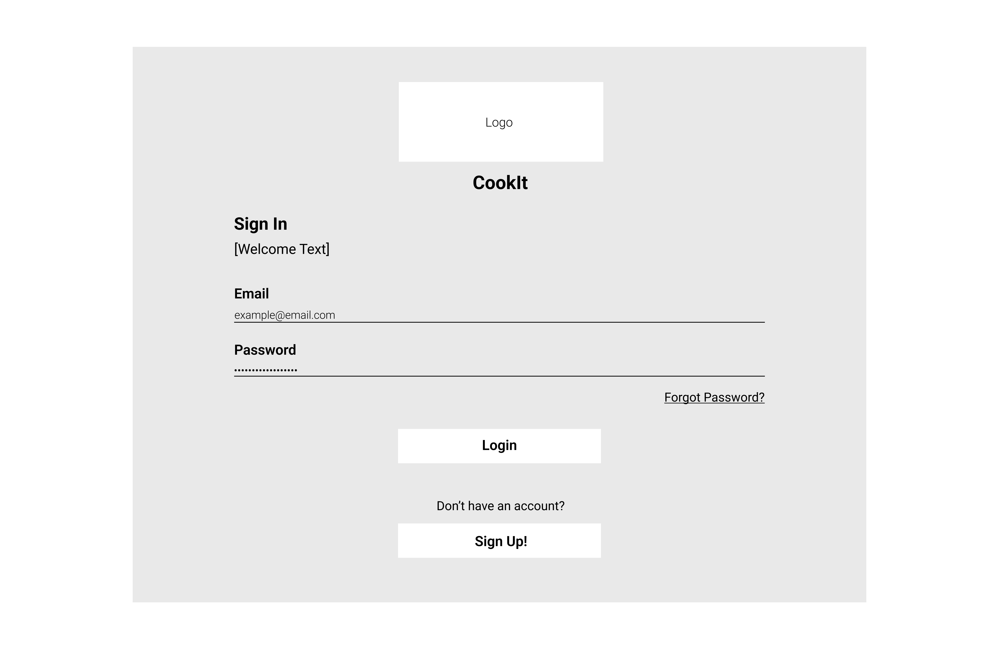
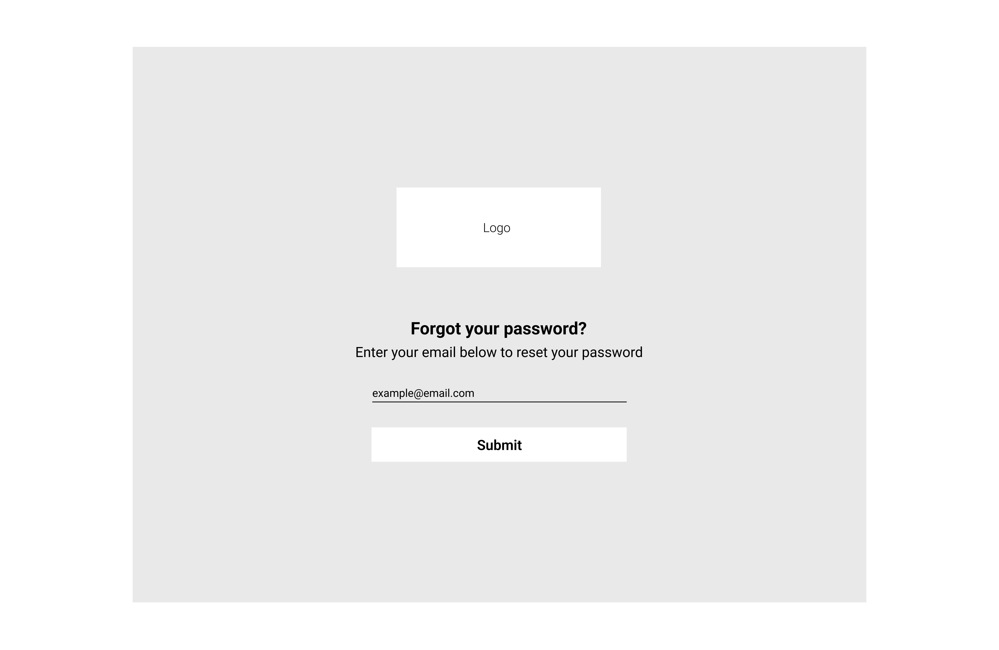
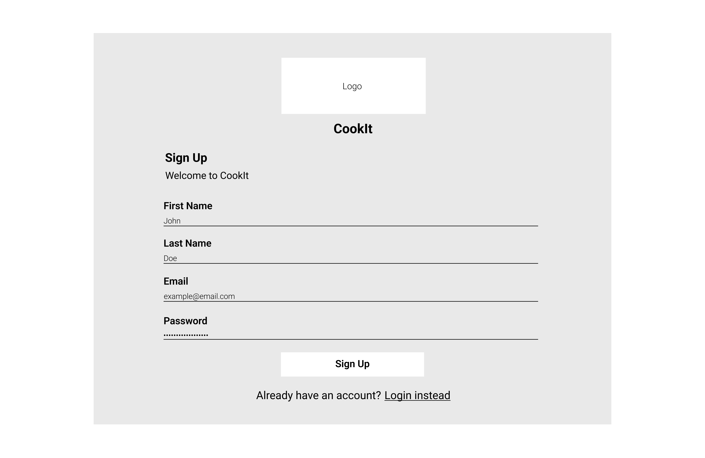
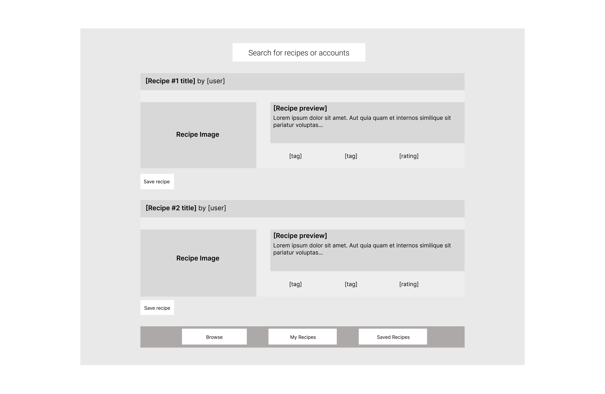
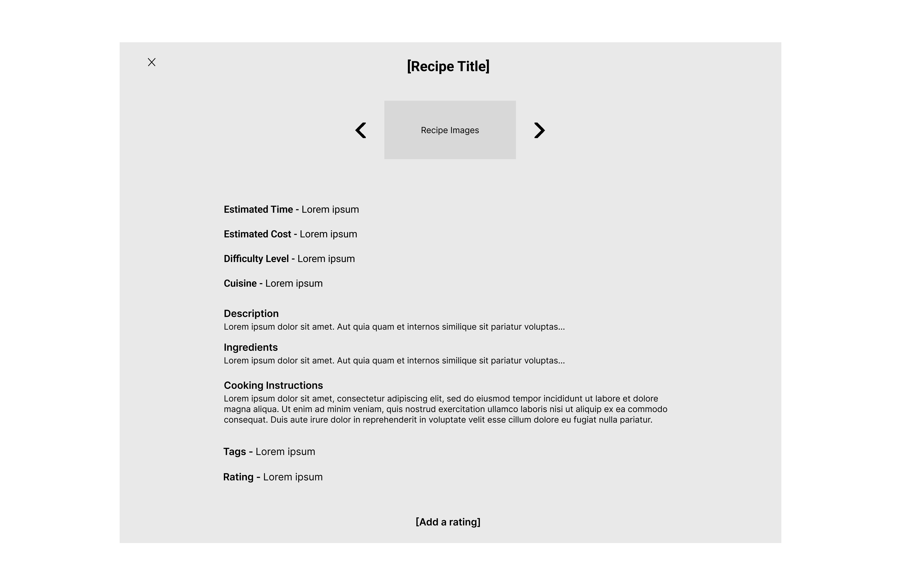
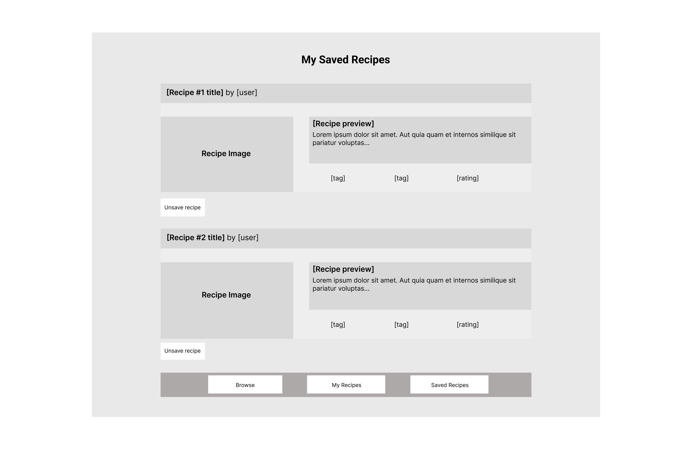
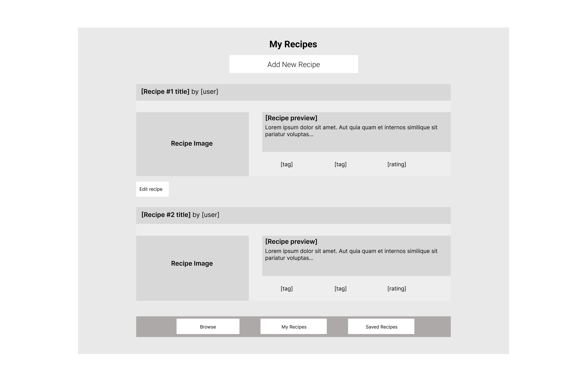
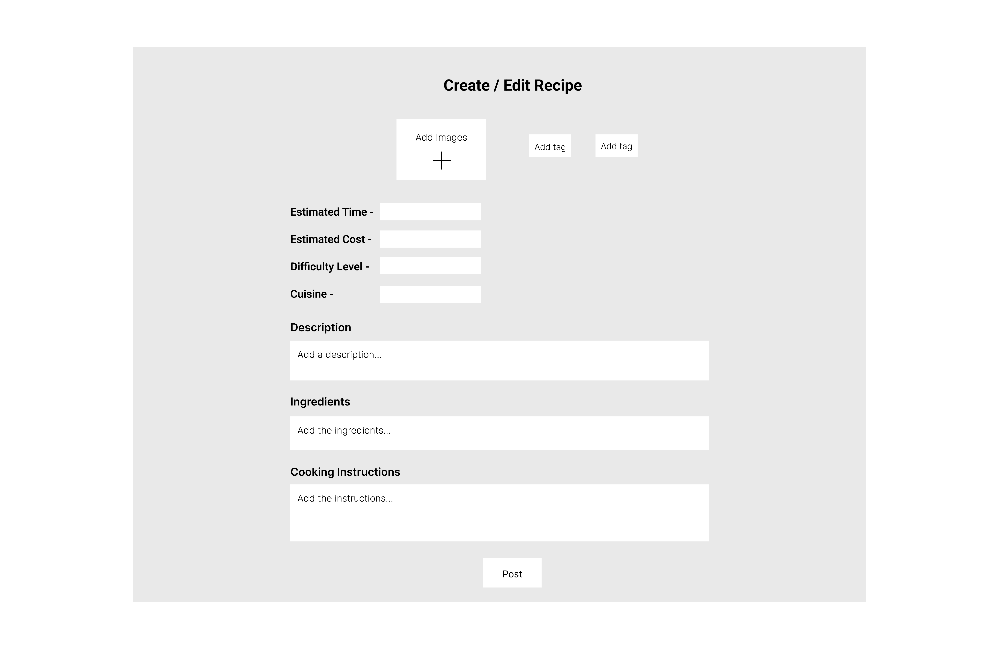

# Cook Book! 

## Overview

Unless you really enjoy cooking, thinking about your meals every day can be a real pain. Eating out is all fun and games until you realize you're broke and getting really unhealthy. Even if one gets the motivation to stay home and cook their meals themselves, it seems like an unfair expectation to come up with ideas for three different meals every day. That's where Cook Book comes in!

Cook Book is a web app that allows users to post recipes, look at other people's recipes, and engage with a community over their shared love for cooking. The app is for everyone with an interest in cooking, from busy college students trying to be good at cooking to professional chefs wanting people to follow their recipes.

## Data Model

The application will store Users, Recipes and Comments

* users can have multiple recipes (via references)
* each recipe can have multiple comments (via references)

An Example User:

```javascript
{
  username: {type: String, required: true}, // username
  recipes: [], // an array of recipes posted by the user
  saved: [], // an array of recipes saved by the user
  salt: String, // salt
  hash: String // hash
}
```

An Example Recipe:

```javascript
{
  user: {type: mongoose.Schema.Types.ObjectId, ref: 'User'}, // reference to user
  title: String, // title of the recipe
  image: String,
  // tags: ["tag1", "tag2"],
  estimatedTime: Number
  numServings: Number,
  estimatedCost: Number,
  difficultyLevel: String, // easy, medium, hard
  cuisine: String,
  description: String, 
  ingredients: String,
  instructions: String,
  comments: [] // comments on the recipe
}
```

An Example Comment:

```javascript
{
  user: {type: mongoose.Schema.Types.ObjectId, ref: 'User'}, // reference to user who posted the comment
  recipe: {type: mongoose.Schema.Types.ObjectId, ref: 'Recipe'}, // reference to recipe on which comment was posted
  description: String 
}
```

## Wireframes

/login - page for logging in



/reset - page for resetting password



/signup - page for signing up



/browse - page for browsing through recipes



/view - page for viewing a particular recipe in detail



/saved - page for viewing user's saved recipes



/myrecipes - page for viewing user's own recipes



/create-edit - page for creating or editing a recipe



## Annotations / References Used

1. [Passport.js authentication docs](http://passportjs.org/docs)
2. [Bootstrap documentation](https://getbootstrap.com/docs/5.2/getting-started/introduction/)
3. [MDN docs on client-side form validation](https://developer.mozilla.org/en-US/docs/Learn/Forms/Form_validation)
4. [npm documentation on multer](https://www.npmjs.com/package/multer)

